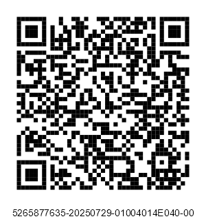
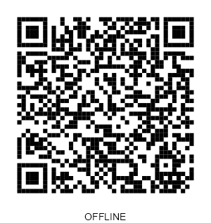
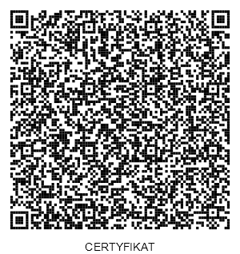

## QR Verification Codes
21.08.2025

A QR code (Quick Response) is a graphical representation of text, most commonly a URL. In the context of KSeF, it is an encoded link containing invoice identification data - this format allows for quick reading of information using end devices (smartphones or optical scanners). This enables the link to be scanned and redirected directly to the appropriate KSeF system resource responsible for invoice visualization and verification or the issuer's KSeF certificate.

QR codes were introduced for situations when an invoice reaches the recipient through a channel other than direct download from the KSeF API (e.g., as a PDF, printout, or email attachment). In such cases, anyone can:
- verify whether a given invoice actually exists in the KSeF system and whether it has been modified,
- download its structured version (XML file) without needing to contact the issuer,
- confirm the issuer's authenticity (in the case of offline invoices).

Code generation (both for online and offline invoices) is performed locally in the client application based on the data contained in the issued invoice. The QR code must comply with the ISO/IEC 18004:2024 standard. If it is not possible to place the code directly on the invoice (e.g., the data format does not allow it), it should be delivered to the recipient as a separate graphic file or link.

### Environments

Below are the URL addresses for individual KSeF environments used to generate QR codes:

| Abbreviation | Environment                       | Address (QR)                                  |
|--------------|-----------------------------------|-----------------------------------------------|
| **TE**       | Test <br/> (Release Candidate)    | https://qr-test.ksef.mf.gov.pl                |
| **DEMO**     | Pre-production (Demo/Preprod)     | https://qr-demo.ksef.mf.gov.pl                |
| **PRD**      | Production                        | https://qr.ksef.mf.gov.pl                     |

> **Note**: The examples below are prepared for the test environment (TE). For other environments, proceed analogously using the appropriate URL address from the table above.

Depending on the issuance mode (online or offline), the following is placed on the invoice visualization:
- in **online** mode - one QR code (CODE I), enabling invoice verification and download from KSeF,
- in **offline** mode - two QR codes:
  - **CODE I** for invoice verification after it has been sent to KSeF,
  - **CODE II** for confirming the issuer's authenticity based on the [KSeF certificate](/certyfikaty-KSeF.md).

### 1. CODE I - Invoice Verification and Download

```CODE I``` contains a link enabling invoice reading and verification in the KSeF system.
After scanning the QR code or clicking the link, the user will receive a simplified presentation of the invoice's basic data and information about its presence in the KSeF system. Full access to the content (e.g., downloading the XML file) requires entering additional data.

#### Link Generation
The link consists of:
- URL address: `https://qr-test.ksef.mf.gov.pl/invoice`,
- invoice issue date (field `P_1`) in DD-MM-YYYY format,
- seller's NIP (tax identification number),
- invoice file hash calculated using the SHA-256 algorithm (invoice file identifier) in Base64URL format.

For example, for an invoice:
- issue date: "01-02-2026",
- seller's NIP: "1111111111",
- SHA-256 hash in Base64URL format: "UtQp9Gpc51y-u3xApZjIjgkpZ01js-J8KflSPW8WzIE"

The generated link looks as follows:
```
https://qr-test.ksef.mf.gov.pl/invoice/1111111111/01-02-2026/UtQp9Gpc51y-u3xApZjIjgkpZ01js-J8KflSPW8WzIE
```

Example in ```C#```:
[KSeF.Client.Tests.Core\E2E\QrCode\QrCodeOnlineE2ETests.cs](https://github.com/CIRFMF/ksef-client-csharp/blob/main/KSeF.Client.Tests.Core/E2E/QrCode/QrCodeOnlineE2ETests.cs)
```csharp
string url = linkSvc.BuildInvoiceVerificationUrl(nip, issueDate, invoiceHash);
```

Example in Java:
```java
String url = linkSvc.buildInvoiceVerificationUrl(nip, issueDate, xml);
```

#### QR Code Generation
Example in ```C#```:
[KSeF.Client.Tests.Core\E2E\QrCode\QrCodeE2ETests.cs](https://github.com/CIRFMF/ksef-client-csharp/blob/main/KSeF.Client.Tests.Core/E2E/QrCode/QrCodeE2ETests.cs)

```csharp
private const int PixelsPerModule = 5;
byte[] qrBytes = qrCodeService.GenerateQrCode(url, PixelsPerModule);
```

Example in Java:
[QrCodeOnlineIntegrationTest.java](https://github.com/CIRFMF/ksef-client-java/blob/main/demo-web-app/src/integrationTest/java/pl/akmf/ksef/sdk/QrCodeOnlineIntegrationTest.java)

```java
byte[] qrOnline = qrCodeService.generateQrCode(invoiceForOnlineUrl);
```

#### Label Below QR Code
The invoice acceptance process by KSeF usually occurs instantly - the KSeF number is generated immediately after the document is submitted. In exceptional cases (e.g., high system load), the number may be assigned with a slight delay.

- **If the KSeF number is known:** the KSeF invoice number is placed below the QR code (applies to online invoices and offline invoices already submitted to the system).



- **If the KSeF number has not yet been assigned:** the label **OFFLINE** is placed below the QR code (applies to offline invoices before submission or online invoices awaiting a number).



Example in ```C#```:
[KSeF.Client.Tests.Core\E2E\QrCode\QrCodeE2ETests.cs](https://github.com/CIRFMF/ksef-client-csharp/blob/main/KSeF.Client.Tests.Core/E2E/QrCode/QrCodeE2ETests.cs)

```csharp
byte[] labeled = qrCodeService.AddLabelToQrCode(qrBytes, GeneratedQrCodeLabel);
```

Example in Java:
[QrCodeOnlineIntegrationTest.java](https://github.com/CIRFMF/ksef-client-java/blob/main/demo-web-app/src/integrationTest/java/pl/akmf/ksef/sdk/QrCodeOnlineIntegrationTest.java)

```java
byte[] qrOnline = qrCodeService.addLabelToQrCode(qrOnline, invoiceKsefNumber);
```

### 2. CODE II - Certificate Verification

```CODE II``` is generated only for invoices issued in offline mode (offline24, offline-system unavailability, emergency mode) and serves to confirm the **issuer's** authenticity and their authorization to issue an invoice on behalf of the seller. Generation requires having an active [Offline type KSeF certificate](/certyfikaty-KSeF.md) - the link contains a cryptographic signature of the URL using the private key of the Offline type KSeF certificate, which prevents link forgery by entities without access to the certificate.

> **Note**: The `Authentication` type certificate cannot be used to generate CODE II. Its purpose is solely for API authentication.

The Offline type KSeF certificate can be obtained using the [`/certificates`](https://api-test.ksef.mf.gov.pl/docs/v2/index.html#tag/Certyfikaty/paths/~1api~1v2~1certificates~1enrollments/post) endpoint.


#### Verification After Scanning QR Code II

After navigating to the link from the QR code, the KSeF system automatically verifies the issuer's certificate.
This process includes the following stages:

1. **Issuer's KSeF Certificate**

   * The certificate exists in the KSeF certificate registry and is **valid**.
   * The certificate has not been **revoked**, **blocked**, and has not expired (`validTo`).

2. **Issuer's Signature**

   * The system verifies the **signature correctness** attached in the URL.

3. **Issuer's Permissions**

   * The entity identified by the issuer's certificate has **active permissions** to issue invoices in the context (`ContextIdentifier`),
   * Verification is performed according to the rules described in the [authentication.md](uwierzytelnianie.md) document,
   * For example: an accountant signing an invoice on behalf of company A must have the `InvoiceWrite` right granted in the context of that company.

4. **Context and Seller's NIP Compliance**

   * The system checks whether the context (`ContextIdentifier`) has the right to issue invoices for the given **seller's NIP** (`Podmiot1` of the invoice).
     This applies to, among others:
     * self-invoicing (`SelfInvoicing`),
     * tax representative (`TaxRepresentative`),
     * VAT groups,
     * local government units (JST),
     * subordinate units identified by internal identifier,
     * bailiff,
     * enforcement authority,
     * PEF invoices issued on behalf of another entity by a Peppol service provider,
     * invoices issued by a European entity.

    **Example 1. Invoice issuance by an entity in their own context**

    An entity issues an invoice using a certificate containing their own NIP number.
    The invoice is issued in the context of the same entity, and the seller's NIP field contains their own NIP number.

    | Issuer Identifier (certificate) | Context    | Seller's NIP   |
    | ------------------------------- | ---------- | -------------- |
    | 1111111111                      | 1111111111 | 1111111111     |

    **Example 2. Invoice issuance by an authorized person on behalf of an entity**

    A natural person (e.g., an accountant) using a KSeF certificate containing a PESEL number issues an invoice in the context of an entity on whose behalf they have appropriate permissions.
    The seller's NIP field contains the NIP number of that entity.


    | Issuer Identifier (certificate) | Context    | Seller's NIP   |
    | ------------------------------- | ---------- | -------------- |
    | 22222222222                     | 1111111111 | 1111111111     |


    **Example 3. Invoice issuance on behalf of another entity**

    A natural person issues an invoice in the context of entity A, but the seller's NIP field on the invoice contains the NIP number of another entity B.
    This situation is possible when entity A has been granted the right to issue invoices on behalf of entity B, e.g., tax representative, self-invoicing.

    | Issuer Identifier (certificate) | Context    | Seller's NIP   |
    | ------------------------------- | ---------- | -------------- |
    | 22222222222                     | 1111111111 | 3333333333     |


#### Link Generation

The verification link consists of:
- URL address: `https://qr-test.ksef.mf.gov.pl/certificate`,
- login context identifier type ([`ContextIdentifier`](uwierzytelnianie.md)): "Nip", "InternalId", "NipVatUe", "PeppolId"
- login context identifier value,
- seller's NIP,
- issuer's KSeF certificate serial number,
- invoice file SHA-256 hash in Base64URL format,
- link signature using the issuer's KSeF certificate private key (encoded in Base64URL format).

**Signature Format**
For signing, the URL path fragment without the protocol prefix (https://) and without the trailing / is used, e.g.:
```
qr-test.ksef.mf.gov.pl/certificate/Nip/1111111111/1111111111/01F20A5D352AE590/UtQp9Gpc51y-u3xApZjIjgkpZ01js-J8KflSPW8WzIE
```

**Signature Algorithms:**

* **RSA (RSASSA-PSS)**
  - Hash function: SHA-256
  - MGF: MGF1 with SHA-256
  - Random salt length: 32 bytes
  - Required key length: Minimum 2048 bits.

  The string to be signed is first hashed with the SHA-256 algorithm, and then a signature is generated according to the RSASSA-PSS scheme.

* **ECDSA (P-256/SHA-256)**
  The string to be signed is hashed with the SHA-256 algorithm, and then a signature is generated using the ECDSA private key based on the NIST P-256 curve (secp256r1), which should be specified when generating the CSR.

  The signature value is a pair of integers (r, s). It can be encoded in one of two formats:
  - **IEEE P1363 Fixed Field Concatenation** - **recommended method** due to shorter resulting string and fixed length. Format simpler and shorter than DER. Signature is concatenation R || S (32 bytes each, big-endian).
  - **ASN.1 DER SEQUENCE (RFC 3279)** - signature is encoded as ASN.1 DER. Signature size is variable. We recommend using this type of signature only when IEEE P1363 is not possible due to technical limitations.

In both cases (regardless of whether RSA or ECDSA is chosen), the obtained signature value should be encoded in Base64URL format.


For example, for an invoice:
- login context identifier type: "Nip",
- context identifier value: "1111111111",
- seller's NIP: "1111111111",
- issuer's KSeF certificate serial number: "01F20A5D352AE590",
- SHA-256 hash in Base64URL format: "UtQp9Gpc51y-u3xApZjIjgkpZ01js-J8KflSPW8WzIE",
- link signature using the issuer's KSeF certificate private key: "mSkm_XmM9fq7PgAJwiL32L9ujhyguOEV48cDB0ncemD2r9TMGa3lr0iRoFk588agCi8QPsOuscUY1rZ7ff76STbGquO-gZtQys5_fHdf2HUfDqPqVTnUS6HknBu0zLkyf9ygoW7WbH06Ty_8BgQTlOmJFzNWSt9WZa7tAGuAE9JOooNps-KG2PYkkIP4q4jPMp3FKypAygHVnXtS0RDGgOxhhM7LWtFP7D-dWINbh5yXD8Lr-JVbeOpyQjHa6WmMYavCDQJ3X_Z-iS01LZu2s1B3xuOykl1h0sLObCdADrbxOONsXrvQa61Xt_rxyprVraj2Uf9pANQgR4-12HEcMw"

The generated link looks as follows:

```
https://qr-test.ksef.mf.gov.pl/certificate/Nip/1111111111/1111111111/01F20A5D352AE590/UtQp9Gpc51y-u3xApZjIjgkpZ01js-J8KflSPW8WzIE/mSkm_XmM9fq7PgAJwiL32L9ujhyguOEV48cDB0ncemD2r9TMGa3lr0iRoFk588agCi8QPsOuscUY1rZ7ff76STbGquO-gZtQys5_fHdf2HUfDqPqVTnUS6HknBu0zLkyf9ygoW7WbH06Ty_8BgQTlOmJFzNWSt9WZa7tAGuAE9JOooNps-KG2PYkkIP4q4jPMp3FKypAygHVnXtS0RDGgOxhhM7LWtFP7D-dWINbh5yXD8Lr-JVbeOpyQjHa6WmMYavCDQJ3X_Z-iS01LZu2s1B3xuOykl1h0sLObCdADrbxOONsXrvQa61Xt_rxyprVraj2Uf9pANQgR4-12HEcMw
```

Example in ```C#```:
[KSeF.Client.Tests.Core\E2E\QrCode\QrCodeOfflineE2ETests.cs](https://github.com/CIRFMF/ksef-client-csharp/blob/main/KSeF.Client.Tests.Core/E2E/QrCode/QrCodeOfflineE2ETests.cs)
```csharp
 var certificate = new X509Certificate2(Convert.FromBase64String(certbase64));

 byte[] qrOfflineCode = QrCodeService.GenerateQrCode(
    linkService.BuildCertificateVerificationUrl(
        nip,
        nip,
        certificate.CertificateSerialNumber,
        invoiceHash,
        certificate));
```

Example in Java:
[QrCodeOfflineIntegrationTest.java](https://github.com/CIRFMF/ksef-client-java/blob/main/demo-web-app/src/integrationTest/java/pl/akmf/ksef/sdk/QrCodeOfflineIntegrationTest.java)

```java
String pem = privateKeyPemBase64.replaceAll("\\s+", "");
byte[] keyBytes = java.util.Base64.getDecoder().decode(pem);

String url = verificationLinkService.buildCertificateVerificationUrl(
    contextNip,
    ContextIdentifierType.NIP,
    contextNip,
    certificate.getCertificateSerialNumber(),
    invoiceHash,
    cryptographyService.parsePrivateKeyFromPem(keyBytes));
```

#### QR Code Generation
Example in ```C#```:
[KSeF.Client.Tests.Core\E2E\QrCode\QrCodeE2ETests.cs](https://github.com/CIRFMF/ksef-client-csharp/blob/main/KSeF.Client.Tests.Core/E2E/QrCode/QrCodeE2ETests.cs)

```csharp
byte[] qrBytes = qrCodeService.GenerateQrCode(url, PixelsPerModule);
```

Example in Java:
[QrCodeOnlineIntegrationTest.java](https://github.com/CIRFMF/ksef-client-java/blob/main/demo-web-app/src/integrationTest/java/pl/akmf/ksef/sdk/QrCodeOnlineIntegrationTest.java)

```java
byte[] qrOnline = qrCodeService.generateQrCode(invoiceForOnlineUrl);
```

#### Label Below QR Code

Below the QR code, the label **CERTIFICATE** should be placed, indicating the KSeF certificate verification function.

Example in ```C#```:
[KSeF.Client.Tests.Core\E2E\QrCode\QrCodeE2ETests.cs](https://github.com/CIRFMF/ksef-client-csharp/blob/main/KSeF.Client.Tests.Core/E2E/QrCode/QrCodeE2ETests.cs)

```csharp
private const string GeneratedQrCodeLabel = "CERTYFIKAT";
byte[] labeled = qrCodeService.AddLabelToQrCode(qrBytes, GeneratedQrCodeLabel);
```

Example in Java:
[QrCodeOnlineIntegrationTest.java](https://github.com/CIRFMF/ksef-client-java/blob/main/demo-web-app/src/integrationTest/java/pl/akmf/ksef/sdk/QrCodeOnlineIntegrationTest.java)

```java
byte[] qrOnline = qrCodeService.addLabelToQrCode(qrOnline, invoiceKsefNumber);
```


